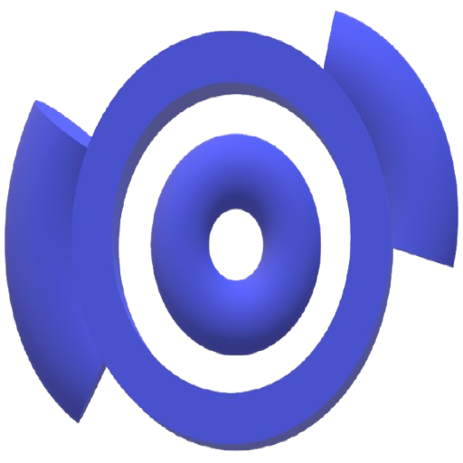

# Downloader for Mac

A simple, native macOS desktop app for downloading audio from YouTube. Paste a URL, pick MP3 or WebM, hit Download. That's it.

Built because most YouTube downloaders are either Windows-only, paywalled, or sketchy browser extensions. This one is free, open source, and ships as a self-contained `.app` — no Homebrew, no Python, no FFmpeg install required.



## Features

- 🎧 MP3 or WebM audio download
- 📂 Remembers your download folder across sessions
- 📊 Live progress bar with speed and ETA
- 🍎 Native macOS `.app` — Apple Silicon (arm64)
- 📦 Fully self-contained — yt-dlp and FFmpeg bundled inside
- 🌙 Clean dark UI
- 🔒 No tracking, no accounts, no cloud

## Download

Grab the latest build from the [Releases](https://github.com/ahfoysal/downloader-for-mac/releases) page:

- **`.dmg`** — standard installer, drag to Applications
- **`.zip`** — portable, unzip and run

### First launch

The app is unsigned (no paid Apple Developer cert), so macOS Gatekeeper will block it the first time. Two ways to open:

**Option 1 — right-click to open:**
1. Right-click the app → **Open**
2. Click **Open** in the dialog

**Option 2 — one-line command:**
```bash
xattr -dr com.apple.quarantine "/Applications/Downloader for Mac.app"
```

After that, it launches normally.

## Usage

1. Click **Select Download Folder** — picks where files save
2. Paste a YouTube URL
3. Pick **MP3** (converted) or **WebM** (original audio, higher quality)
4. Click **Download**

First click takes ~15–20 seconds before the progress bar moves — yt-dlp unpacks on first run and fetches video metadata. Subsequent downloads are fast.

## How it works

This is a thin Electron wrapper around two open-source tools:

- [`yt-dlp`](https://github.com/yt-dlp/yt-dlp) — resolves YouTube stream URLs and downloads audio
- [`ffmpeg`](https://ffmpeg.org/) — converts to MP3 when requested

No reverse-engineered YouTube APIs, no backend servers, no scraping tricks. Just a GUI.

## Build from source

### Requirements
- macOS on Apple Silicon (arm64)
- Node.js 20+
- ~500 MB free disk (Electron is chunky)

### Steps
```bash
git clone https://github.com/ahfoysal/downloader-for-mac.git
cd downloader-for-mac
npm install
```

Download the two bundled binaries into `bin/`:
```bash
mkdir -p bin
curl -L -o bin/yt-dlp https://github.com/yt-dlp/yt-dlp/releases/latest/download/yt-dlp_macos
curl -L -o bin/ffmpeg.zip https://www.osxexperts.net/ffmpeg81arm.zip
unzip -o bin/ffmpeg.zip -d bin/ && rm bin/ffmpeg.zip
chmod +x bin/yt-dlp bin/ffmpeg
```

Run in dev mode:
```bash
npm start
```

Build a signed-less `.app` + `.dmg`:
```bash
npm run dist:mac
```

Output lands in `dist/`.

## Why no code signing?

Apple charges $99/year for a Developer ID. This is a personal hobby project — not worth it. If you'd rather not run unsigned software, build from source yourself; it's a 3-command process.

## Disclaimer

This tool is for **personal and educational use only** — downloading your own content, Creative Commons works, public-domain audio, or content you're otherwise authorized to save.

Downloading copyrighted YouTube content without permission may violate YouTube's Terms of Service and copyright law in your jurisdiction. **You are responsible for what you download.** The author does not condone piracy and is not liable for misuse.

## Credits

This project is a macOS fork of [Refloow/YouTube-Music-Download](https://github.com/Refloow/YouTube-Music-Download), which provides the original Electron scaffold (Windows-targeted). All downloading is done by [yt-dlp](https://github.com/yt-dlp/yt-dlp) and all audio conversion by [FFmpeg](https://ffmpeg.org/).

## License

MIT — see [LICENSE](./LICENSE).
